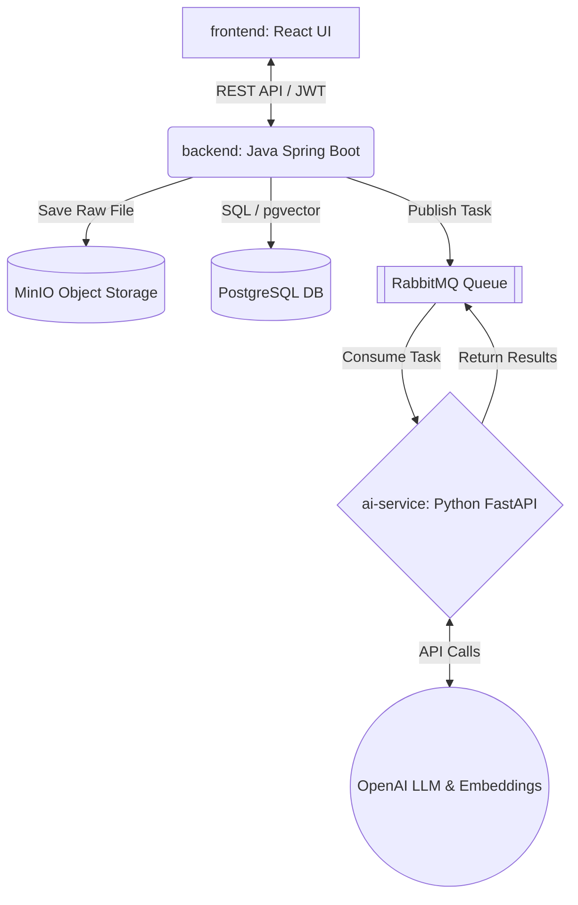

<!-- Language Switcher / 语言切换 / 語言切換 -->
> [English](Resume_Assistant_Proposal.en_US.md) | [简体中文](Resume_Assistant_Proposal.zh-Hans-CN.md) | [繁體中文](Resume_Assistant_Proposal.zh-Hant-TW.md)

# Course Project Proposal: Resume Assistant

**Course:** SER 594: AI for Software Engineers  
**Project Title:** Resume Assistant

## 1. Team Roster

* **Guixing Jia** | ASU ID: 1235556350 | GitHub & Email: <guixingj@asu.edu>
  * *Role:* Project Manager & Python AI Service & Frontend
* **Hansheng Zhang** | ASU ID: 1235165167 | GitHub & Email: <hzhan516@asu.edu>
  * *Role:* Java Backend & Database Lead
* **Mu-Hsi Yu** | ASU ID: 1236289797 | GitHub & Email: <muhsiyu@asu.edu>
  * *Role:* Frontend & UX Lead & Python AI Service

## 2. Repository Link(s)

* **Main Monorepo:** <https://github.com/hzhan516/ser594_26spring_ai_project>
  * *(Note: The repository is currently private. The Instructor and TAs have been added as collaborators.)*

## 3. Abstract

The **Resume Assistant** is an AI-powered platform designed to streamline the job hunting process for new graduates and career changers. It automatically parses user-uploaded resumes, evaluates them against job market data using semantic vector matching, and provides an interactive AI copilot to iteratively optimize resume content. By combining secure document management, asynchronous AI processing, and personalized recommendations, the system saves users hours of manual tailoring while increasing their interview chances.

## 4. Objective

The system will accept user-uploaded resumes (PDF/Word), interactive chat messages, and job descriptions as specific **inputs**. It will produce strictly structured resume data (JSON), dynamically generated optimized resume versions (Markdown), ranked job recommendations, and contextual chat feedback as **outputs**. The specific behavior includes asynchronously parsing documents via a message queue (RabbitMQ), maintaining three distinct versions of a resume (Original, Converted, AI-Optimized) with rollback capabilities, executing semantic job matching via a PostgreSQL vector database, and persistent user-specific application tracking.

## 5. Motivation

Tailoring a resume for different job postings is a highly repetitive, error-prone, and time-consuming process. Existing job boards rely heavily on rigid keyword-matching (TF-IDF), causing qualified candidates to be filtered out due to synonym mismatches. Conversely, generic AI chatbots (like ChatGPT) lack persistent state, cannot track application pipelines, and do not provide a structured way to manage document versions. The **Resume Assistant** solves this by seamlessly weaving persistent state management (Domain-Driven Design backend), asynchronous AI processing, and semantic search into a unified, privacy-focused engineering solution.

## 6. AI Techniques

The system will deeply integrate the following AI techniques into its core business logic, all encapsulated within the dedicated `ai-service` module:

1. **Prompt Engineering with Structured Outputs**

    * **(a) What it does:** Extracts raw text from uploaded resumes and strictly parses it into a predefined JSON schema (e.g., Skills, Experience, Education), handling malformed outputs gracefully.

    * **(b) Integration:** Handled by the stateless Python FastAPI application in `ai-service`. It consumes a message from RabbitMQ, calls the LLM with `response_format` (JSON schema), and sends the structured data back to the Java backend for relational database persistence.
    * **(c) Evaluation:** **F1 Score** of extracted entities (Name, Skills, Dates) compared against a manually annotated ground-truth dataset of 20 curated resumes.

2. **Vector Search / Embeddings**
    * **(a) What it does:** Converts parsed resume summaries and job descriptions into high-dimensional vectors to calculate semantic similarity for intelligent job matching.
    * **(b) Integration:** The `ai-service` generates embeddings (e.g., via `text-embedding-3-small`) and stores them in PostgreSQL using the `pgvector` extension. The Java backend queries this data via Cosine Similarity ranking.
    * **(c) Evaluation:** **NDCG@5 (Normalized Discounted Cumulative Gain)** to measure the ranking quality of recommended jobs compared to a baseline keyword-search algorithm (BM25).

3. **Memory & RAG (Retrieval-Augmented Generation)**
    * **(a) What it does:** Powers the interactive resume-optimization chat. It retrieves the specific user's resume content (RAG) and maintains conversational history across sessions (Memory).
    * **(b) Integration:** The user selects a specific resume version in the React UI. The Python engine injects this document's text as context and retrieves past chat messages from the DB to maintain a coherent multi-turn advisory session.
    * **(c) Evaluation:** **Context Relevance Score** (using a custom LLM-as-a-judge rubric) measuring whether the AI's suggestions accurately reflect the specific resume version selected, compared to a zero-shot/no-RAG baseline.

4. **LLM API Integration (Resilient Wrapper)**
    * **(a) What it does:** A production-grade API wrapper abstracting the OpenAI client within `ai-service`.
    * **(b) Integration:** Implements exponential backoff retries, token/cost tracking sent back to the database, and graceful degradation if the API is rate-limited or fails.

## 7. System Architecture

The Resume Assistant utilizes a strictly structured Monorepo containing decoupled Microservices, separating business logic from heavy AI workloads, along with dedicated root-level evaluation and testing directories.

* **Frontend (`frontend/`):** React 18 / Vite UI for document management, chat interaction, and application tracking.
* **Backend (`backend/`):** Java Spring Boot 3.x using a Domain-Driven Design (DDD) architecture (separated into `api`, `app`, `domain`, `infrastructure`, `trigger`, and `types` layers) to handle JWT Auth, CRUD, and multi-version document state.
* **AI Pipeline (`ai-service/`):** A stateless Python FastAPI application managing all LLM interactions, structured parsing, and vector computations.
* **Evaluation (`eval/`):** Dedicated root directory containing Python scripts for computing AI metrics and baseline comparisons.
* **Test Suite (`tests/`):** Root directory orchestrating 15+ end-to-end integration tests across the system components.
* **Data Layer:** PostgreSQL (relational data) + `pgvector` (embeddings). MinIO (S3-compatible) is used for raw PDF/Word file storage.
* **Data Flow:** When a user uploads a PDF, the backend saves it to MinIO and publishes an event to **RabbitMQ**. The `ai-service` consumes the event, fetches the file, extracts/embeds the data via OpenAI, and returns the result via the MQ back to the backend.

## 8. Evaluation Plan

The evaluation suite will be executed via automated Python scripts located in the root `eval/` directory.

1. **AI Metric 1: Extraction Accuracy (F1 Score).** We will manually annotate 20 sample resumes to create a JSON ground truth. We will run our Structured Output pipeline on these resumes and calculate the F1 score for key fields. **Baseline:** A traditional Regex/Rule-based parser.

2. **AI Metric 2: Recommendation Quality (NDCG@5).** We will curate 5 sample resumes and a pool of 50 job descriptions. Human evaluators will rank the top 5 ideal matches for each resume. We will compare our `pgvector` cosine similarity results against the human ranking. **Baseline:** Standard keyword matching (no embeddings).

3. **System-Level Evaluation:** We will use load-testing tools (e.g., Locust/JMeter) against the API, ensuring API error rates under normal usage are `< 1%`, and response latency (p95) for vector matching is `< 5 seconds`. We require `> 80%` test coverage orchestrated via the root `tests/` directory (combining JUnit for Java and Pytest for Python), enforced by GitHub Actions CI.

## 9. Timeline & Risks

* **Milestone 1 - Setup & Proposal:** Finalize system architecture, database schema, Docker Compose environment (MinIO, Postgres, MQ), and implement basic JWT Authentication.
* **Milestone 2 - Design & Prototype:** `ai-service` setup with API Wrapper. Implement RabbitMQ asynchronous communication. Complete AI Technique #1 (Structured Output parsing) and end-to-end file upload flow.
* **Milestone 3 - Implementation:** Implement `pgvector` semantic search (AI Technique #2) and RAG-based Chat (AI Technique #3). Finalize React UI, write 15+ automated tests, and configure CI pipeline.
* **Milestone 4 - Final Submission:** Compute evaluation metrics against baselines. Refactor and clean up code, record the 10-to-15-minute demo video, and finalize README documentation.

### Risks & Mitigation Strategies

1. **Risk:** Asynchronous AI parsing tasks hanging or failing, leaving the UI in an infinite "loading" state.
    * **Mitigation:** Implement Dead Letter Queues (DLQ) in RabbitMQ and timeout fallbacks in the `backend` to update the document status to "FAILED", allowing the user to retry.
2. **Risk:** High latency in vector retrieval affecting user experience.
    * **Mitigation:** Apply appropriate HNSW (Hierarchical Navigable Small World) indexes on the `pgvector` columns and limit the initial search space.
3. **Risk:** LLM API cost overruns during the parsing of complex PDFs.
    * **Mitigation:** The `ai-service` wrapper will track token usage per user and cache embedding results to avoid redundant API calls.
