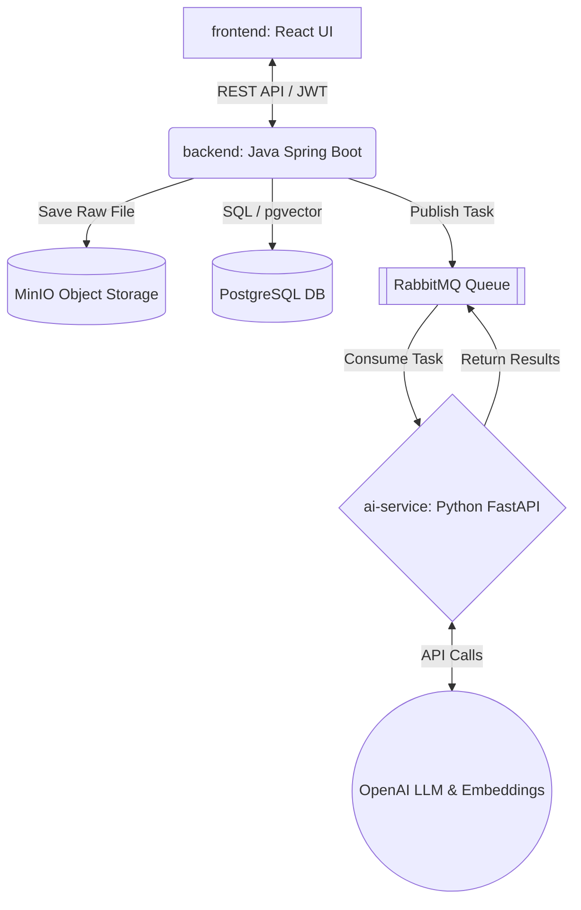

<!-- Language Switcher / 语言切换 / 語言切換 -->
> [English](Resume_Assistant_Proposal.en_US.md) | [简体中文](Resume_Assistant_Proposal.zh-Hans-CN.md) | [繁體中文](Resume_Assistant_Proposal.zh-Hant-TW.md)

# 課程專案提案：智慧求職助手 (Resume Assistant)

**課程:** SER 594: 軟體工程師的 AI 應用  
**專案標題:** 智慧求職助手 (Resume Assistant)

## 1. 團隊成員

* **Guixing Jia** | ASU ID: 1235556350 | GitHub & 電子郵件: <guixingj@asu.edu>
  * *角色:* 專案經理 & Python AI 服務 & 前端開發
* **Hansheng Zhang** | ASU ID: 1235165167 | GitHub & 電子郵件: <hzhan516@asu.edu>
  * *角色:* Java 後端 & 資料庫負責人
* **Mu-Hsi Yu** | ASU ID: 1236289797 | GitHub & 電子郵件: <muhsiyu@asu.edu>
  * *角色:* 前端 & UX 負責人 & Python AI 服務

## 2. 倉庫連結

* **主 Monorepo:** <https://github.com/hzhan516/ser594_26spring_ai_project>
  * *(註：該倉庫目前為私有。指導教師和助教已被新增為協作者。)*

## 3. 摘要

**智慧求職助手**是一個由 AI 驅動的平台，旨在為應屆畢業生和職業轉換者簡化求職流程。它能夠自動解析使用者上傳的履歷，使用語義向量匹配技術評估履歷與就業市場資料的契合度，並提供互動式的 AI 助手來迭代優化履歷內容。透過結合安全的文件管理、非同步 AI 處理和個人化推薦，該系統為使用者節省了數小時的手動修改時間，同時顯著提高了面試機會。

## 4. 目標

該系統將接受使用者上傳的履歷（PDF/Word）、互動式聊天訊息和職位描述作為特定**輸入**。它將生成嚴格結構化的履歷資料（JSON）、動態生成的最佳化履歷版本（Markdown）、排序後的職位推薦以及上下文聊天回饋作為**輸出**。具體行為包括：透過訊息佇列（RabbitMQ）非同步解析文件、維護履歷的三個不同版本（原始版、轉換版、AI 最佳化版）並支援回滾、透過 PostgreSQL 向量資料庫執行語義職位匹配，以及持久化的使用者特定申請追蹤。

## 5. 動機

為不同的職位發布定制履歷是一個高度重複、容易出錯且耗時的過程。現有的求職板嚴重依賴剛性的關鍵字匹配（TF-IDF），導致合格的候選人因同義詞不匹配而被過濾掉。相反，通用的 AI 聊天機器人（如 ChatGPT）缺乏持久狀態，無法追蹤申請流程，也不提供管理文件版本的結構化方式。**智慧求職助手**透過將持久狀態管理（領域驅動設計後端）、非同步 AI 處理和語義搜尋無縫整合到一個統一的、注重隱私的工程解決方案中來解決這些問題。

## 6. AI 技術

系統將在核心業務邏輯中深度整合以下 AI 技術，全部封裝在專用的 `ai-service` 模組中：

1. **提示工程與結構化輸出**

    * **(a) 功能：** 從上傳的履歷中提取原始文字，並將其嚴格解析為預定義的 JSON 模式（例如技能、經驗、教育），優雅地處理格式錯誤的輸出。

    * **(b) 整合：** 由 `ai-service` 中的無狀態 Python FastAPI 應用處理。它消費來自 RabbitMQ 的訊息，使用 `response_format`（JSON 模式）呼叫 LLM，並將結構化資料傳送回 Java 後端以持久化到關聯式資料庫。
    * **(c) 評估：** 提取實體（姓名、技能、日期）的 **F1 分數**，與 20 份精選履歷的人工標註真實資料集進行比較。

2. **向量搜尋 / 嵌入**
    * **(a) 功能：** 將解析後的履歷摘要和職位描述轉換為高維向量，以計算語義相似度，實現智慧職位匹配。
    * **(b) 整合：** `ai-service` 生成嵌入（例如透過 `text-embedding-3-small`），並使用 `pgvector` 擴充功能將其儲存在 PostgreSQL 中。Java 後端透過餘弦相似度排序查詢這些資料。
    * **(c) 評估：** **NDCG@5（歸一化折損累積增益）**，用於衡量推薦職位的排序品質，與基準關鍵字搜尋演算法（BM25）進行比較。

3. **記憶與 RAG（檢索增強生成）**
    * **(a) 功能：** 為互動式履歷最佳化聊天提供支援。它檢索特定使用者的履歷內容（RAG），並在會話之間保持對話歷史（記憶）。
    * **(b) 整合：** 使用者在 React UI 中選擇特定履歷版本。Python 引擎將該文件的文本作為上下文注入，並從資料庫檢索過去的聊天訊息，以保持連貫的多輪諮詢會話。
    * **(c) 評估：** **上下文相關性評分**（使用自訂 LLM 作為評判標準），衡量 AI 的建議是否準確反映了所選的具體履歷版本，與零樣本/無 RAG 基線進行比較。

4. **LLM API 整合（彈性包裝器）**
    * **(a) 功能：** 在 `ai-service` 內抽象 OpenAI 客戶端的生產級 API 包裝器。
    * **(b) 整合：** 實現指數退避重試、token/成本追蹤並傳送回資料庫，以及在 API 被速率限制或失敗時的優雅降級。

## 7. 系統架構

智慧求職助手利用嚴格結構化的 Monorepo，包含解耦的微服務，將業務邏輯與繁重的 AI 工作負載分離，以及專用的根級評估和測試目錄。

* **前端 (`frontend/`):** React 18 / Vite UI，用於文件管理、聊天互動和申請追蹤。
* **後端 (`backend/`):** Java Spring Boot 3.x，使用領域驅動設計（DDD）架構（分為 `api`、`app`、`domain`、`infrastructure`、`trigger` 和 `types` 層），處理 JWT 認證、CRUD 和多版本文件狀態。
* **AI 流水線 (`ai-service/`):** 一個無狀態的 Python FastAPI 應用，管理所有 LLM 互動、結構化解析和向量計算。
* **評估 (`eval/`):** 包含計算 AI 指標和基線比較的 Python 腳本的專用根目錄。
* **測試套件 (`tests/`):** 編排跨系統元件的 15+ 端到端整合測試的根目錄。
* **資料層:** PostgreSQL（關聯資料）+ `pgvector`（嵌入）。MinIO（相容 S3）用於原始 PDF/Word 檔案儲存。
* **資料流:** 當使用者上傳 PDF 時，後端將其儲存到 MinIO 並向 **RabbitMQ** 發布事件。`ai-service` 消費該事件，取得檔案，透過 OpenAI 提取/嵌入資料，並透過 MQ 將結果傳回給後端。

## 8. 評估計畫

評估套件將透過位於根 `eval/` 目錄中的自動化 Python 腳本執行。

1. **AI 指標 1：提取準確率（F1 分數）。** 我們將手動標註 20 份樣本履歷以建立 JSON 真實值。我們將在這些履歷上執行結構化輸出流水線，並計算關鍵欄位的 F1 分數。**基線：** 傳統的正則表示式/基於規則的解析器。

2. **AI 指標 2：推薦品質（NDCG@5）。** 我們將整理 5 份樣本履歷和 50 個職位描述池。人工評估者將為每份履歷排名前 5 的理想匹配。我們將比較 `pgvector` 餘弦相似度結果與人工排序。**基線：** 標準關鍵字匹配（無嵌入）。

3. **系統級評估：** 我們將使用負載測試工具（例如 Locust/JMeter）對 API 進行測試，確保正常使用下的 API 錯誤率 `< 1%`，向量匹配的回應延遲（p95）`< 5 秒`。我們要求透過根 `tests/` 目錄編排的 `> 80%` 測試覆蓋率（結合 Java 的 JUnit 和 Python 的 Pytest），由 GitHub Actions CI 強制執行。

## 9. 時間線與風險

* **里程碑 1 - 設定與提案：** 確定系統架構、資料庫模式、Docker Compose 環境（MinIO、Postgres、MQ），並實現基本的 JWT 認證。
* **里程碑 2 - 設計與原型：** `ai-service` 設定與 API 包裝器。實現 RabbitMQ 非同步通訊。完成 AI 技術 #1（結構化輸出解析）和端到端檔案上傳流程。
* **里程碑 3 - 實作：** 實現 `pgvector` 語義搜尋（AI 技術 #2）和基於 RAG 的聊天（AI 技術 #3）。完成 React UI，撰寫 15+ 自動化測試，並配置 CI 流水線。
* **里程碑 4 - 最終提交：** 計算與基線的評估指標。重構和清理程式碼，錄製 10 到 15 分鐘的展示影片，並完成 README 文件。

### 風險與緩解策略

1. **風險：** 非同步 AI 解析任務掛起或失敗，導致 UI 處於無限"載入"狀態。
    * **緩解：** 在 RabbitMQ 中實現死信佇列（DLQ），並在 `backend` 中實現逾時回退，將文件狀態更新為"失敗"，允許使用者重試。
2. **風險：** 向量檢索的高延遲影響使用者體驗。
    * **緩解：** 在 `pgvector` 欄位上套用適當的 HNSW（分層可導航小世界）索引，並限制初始搜尋空間。
3. **風險：** 解析複雜 PDF 時 LLM API 成本超支。
    * **緩解：** `ai-service` 包裝器將追蹤每個使用者的 token 使用量，並快取嵌入結果以避免冗餘的 API 呼叫。
