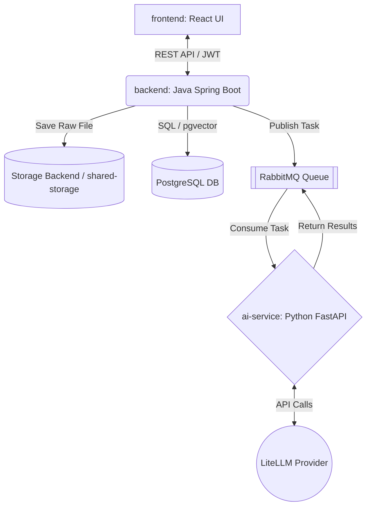

<!-- Language Switcher / 语言切换 / 語言切換 -->
> [English](../../Resume_Assistant_Proposal.md) | [简体中文](Resume_Assistant_Proposal.md) | [繁體中文](../zh-Hant-TW/Resume_Assistant_Proposal.md)

# 课程项目提案：智能求职助手 (Resume Assistant)

**课程:** SER 594: 软件工程师的AI应用  
**项目标题:** 智能求职助手 (Resume Assistant)

## 1. 团队成员

* **Guixing Jia** | ASU ID: 1235556350 | GitHub & 邮箱: <guixingj@asu.edu>
  * *角色:* 项目经理 & Python AI 服务 & 前端开发
* **Hansheng Zhang** | ASU ID: 1235165167 | GitHub & 邮箱: <hzhan516@asu.edu>
  * *角色:* Java 后端 & 数据库负责人
* **Mu-Hsi Yu** | ASU ID: 1236289797 | GitHub & 邮箱: <muhsiyu@asu.edu>
  * *角色:* 前端 & UX 负责人 & Python AI 服务

## 2. 仓库链接

* **主 Monorepo:** <https://github.com/hzhan516/ser594_26spring_ai_project>
  * *(注：该仓库当前为私有。指导教师和助教已被添加为协作者。)*

## 3. 摘要

**智能求职助手**是一个由 AI 驱动的平台，旨在为应届毕业生和职业转换者简化求职流程。它能够自动解析用户上传的简历，使用语义向量匹配技术评估简历与就业市场数据的契合度，并提供交互式的 AI 助手来迭代优化简历内容。通过结合安全的文档管理、异步 AI 处理和个性化推荐，该系统为用户节省了数小时的手动修改时间，同时显著提高了面试机会。

## 4. 目标

该系统将接受用户上传的简历（PDF/Word）、交互式聊天消息和职位描述作为特定**输入**。它将生成严格结构化的简历数据（JSON）、动态生成的优化简历版本（Markdown）、排序后的职位推荐以及上下文聊天反馈作为**输出**。具体行为包括：通过消息队列（RabbitMQ）异步解析文档、维护简历的三个不同版本（原始版、转换版、AI优化版）并支持回滚、通过 PostgreSQL 向量数据库执行语义职位匹配，以及持久化的用户特定申请跟踪。

## 5. 动机

为不同的职位发布定制简历是一个高度重复、容易出错且耗时的过程。现有的求职板严重依赖刚性的关键词匹配（TF-IDF），导致合格的候选人因同义词不匹配而被过滤掉。相反，通用的 AI 聊天机器人（如 ChatGPT）缺乏持久状态，无法跟踪申请流程，也不提供管理文档版本的结构化方式。**智能求职助手**通过将持久状态管理（领域驱动设计后端）、异步 AI 处理和语义搜索无缝整合到一个统一的、注重隐私的工程解决方案中来解决这些问题。

## 6. AI 技术

系统将在核心业务逻辑中深度集成以下 AI 技术，全部封装在专用的 `ai-service` 模块中：

1. **提示工程与结构化输出**

    * **(a) 功能：** 从上传的简历中提取原始文本，并将其严格解析为预定义的 JSON 模式（例如技能、经验、教育），优雅地处理格式错误的输出。

    * **(b) 集成：** 由 `ai-service` 中的无状态 Python FastAPI 应用处理。它消费来自 RabbitMQ 的消息，使用 `response_format`（JSON 模式）调用 LLM，并将结构化数据发送回 Java 后端以持久化到关系数据库。
    * **(c) 评估：** 提取实体（姓名、技能、日期）的 **F1 分数**，与 20 份精选简历的人工标注真实数据集进行比较。

2. **向量搜索 / 嵌入**
    * **(a) 功能：** 将解析后的简历摘要和职位描述转换为高维向量，以计算语义相似度，实现智能职位匹配。
    * **(b) 集成：** `ai-service` 生成嵌入（例如通过 `text-embedding-3-small`），并使用 `pgvector` 扩展将其存储在 PostgreSQL 中。Java 后端通过余弦相似度排序查询这些数据。
    * **(c) 评估：** **NDCG@5（归一化折损累积增益）**，用于衡量推荐职位的排序质量，与基准关键词搜索算法（BM25）进行比较。

3. **记忆与 RAG（检索增强生成）**
    * **(a) 功能：** 为交互式简历优化聊天提供支持。它检索特定用户的简历内容（RAG），并在会话之间保持对话历史（记忆）。
    * **(b) 集成：** 用户在 React UI 中选择特定简历版本。Python 引擎将该文档的文本作为上下文注入，并从数据库检索过去的聊天消息，以保持连贯的多轮咨询会话。
    * **(c) 评估：** **上下文相关性评分**（使用自定义 LLM 作为评判标准），衡量 AI 的建议是否准确反映了所选的具体简历版本，与零样本/无 RAG 基线进行比较。

4. **LLM API 集成（弹性包装器）**
    * **(a) 功能：** 在 `ai-service` 内抽象 LiteLLM 兼容客户端的生产级 API 包装器。
    * **(b) 集成：** 实现指数退避重试、JSON 响应验证、日志记录，以及在 API 被速率限制或失败时的优雅降级。

## 7. 系统架构

智能求职助手利用严格结构化的 Monorepo，包含解耦的微服务，将业务逻辑与繁重的 AI 工作负载分离，以及专用的根级评估和测试目录。

* **前端 (`frontend/`):** React 19 / Vite 7 UI，用于文档管理、聊天交互和申请跟踪。
* **后端 (`backend/`):** Java Spring Boot 3.x，使用领域驱动设计（DDD）架构（分为 `api`、`app`、`domain`、`infrastructure`、`trigger` 和 `types` 层），处理 JWT 认证、CRUD 和多版本文档状态。
* **AI 流水线 (`ai-service/`):** 一个无状态的 Python FastAPI 应用，管理所有 LLM 交互、结构化解析和向量计算。
* **评估 (`eval/`):** 包含计算 AI 指标和基线比较的 Python 脚本的专用根目录。
* **测试套件:** 后端 JUnit 测试位于各后端模块中，AI-service pytest 测试位于 `ai-service/tests`。
* **数据层:** PostgreSQL 存储关系数据和 `pgvector` 嵌入。在 Docker Compose 部署中，上传的 PDF/Word 文件存储在 Docker 命名卷（`shared-storage`）中，并由后端和 AI service 共同挂载。后端也包含可配置的 MinIO/S3 兼容存储支持，但默认 Compose 设置使用本地卷存储。
* **数据流:** 当用户上传 PDF 时，后端通过配置的存储后端保存文件并向 **RabbitMQ** 发布事件。`ai-service` 消费该事件，通过生成的存储 URL 读取文件，使用配置的 LiteLLM provider 提取/嵌入数据，并通过 MQ 将结果返回给后端。

## 8. 评估计划

评估套件将通过位于根 `eval/` 目录中的自动化 Python 脚本执行。

1. **AI 指标 1：提取准确率（F1 分数）。** 我们将手动标注 20 份样本简历以创建 JSON 真实值。我们将在这些简历上运行结构化输出流水线，并计算关键字段的 F1 分数。**基线：** 传统的正则表达式/基于规则的解析器。

2. **AI 指标 2：推荐质量（NDCG@5）。** 我们将整理 5 份样本简历和 50 个职位描述池。人工评估者将为每份简历排名前 5 的理想匹配。我们将比较 `pgvector` 余弦相似度结果与人工排序。**基线：** 标准关键词匹配（无嵌入）。

3. **系统级评估：** 我们将使用负载测试工具（例如 Locust/JMeter）对 API 进行测试，确保正常使用下的 API 错误率 `< 1%`，向量匹配的响应延迟（p95）`< 5 秒`。自动化检查结合后端 JUnit 测试、AI-service pytest 测试，以及 GitHub Actions CI 的后端构建/测试覆盖。

## 9. 时间线与风险

* **里程碑 1 - 设置与提案：** 确定系统架构、数据库模式、Docker Compose 环境（Postgres、RabbitMQ、shared storage），并实现基本的 JWT 认证。
* **里程碑 2 - 设计与原型：** `ai-service` 设置与 API 包装器。实现 RabbitMQ 异步通信。完成 AI 技术 #1（结构化输出解析）和端到端文件上传流程。
* **里程碑 3 - 实现：** 实现 `pgvector` 语义搜索（AI 技术 #2）和基于 RAG 的聊天（AI 技术 #3）。完成 React UI，编写 15+ 自动化测试，并配置 CI 流水线。
* **里程碑 4 - 最终提交：** 计算与基线的评估指标。重构和清理代码，录制 10 到 15 分钟的演示视频，并完成 README 文档。

### 风险与缓解策略

1. **风险：** 异步 AI 解析任务挂起或失败，导致 UI 处于无限"加载"状态。
    * **缓解：** 在 RabbitMQ 中实现死信队列（DLQ），并在 `backend` 中实现超时回退，将文档状态更新为"失败"，允许用户重试。
2. **风险：** 向量检索的高延迟影响用户体验。
    * **缓解：** 在 `pgvector` 列上应用适当的 HNSW（分层可导航小世界）索引，并限制初始搜索空间。
3. **风险：** 解析复杂 PDF 时 LLM API 成本超支。
    * **缓解：** `ai-service` 包装器将跟踪每个用户的 token 使用量，并缓存嵌入结果以避免冗余的 API 调用。
